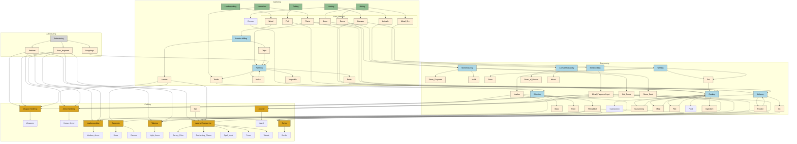

# Full Craft relation
Intended for full relation, for exhaustivity sake and for AI use. Readibility will suffer. 
For readibility, see the simplified version.

```mermaid
graph TB

%% Define styles for professions and outputs
classDef gathering fill:#8FBC8F,stroke:#333,stroke-width:1px,color:#000;
classDef processing fill:#ADD8E6,stroke:#333,stroke-width:1px,color:#000;
classDef crafting fill:#DAA520,stroke:#333,stroke-width:1px,color:#000;
classDef adventuring fill:#D3D3D3,stroke:#333,stroke-width:1px,color:#000;
classDef material fill:#FFEFD5,stroke:#333,stroke-width:1px,color:#000;

%% Adventuring (Placed next to Gathering)
subgraph Adventuring
    direction TB
    Adv1[Adventuring]:::adventuring --> Dropplings:::material
    Adv1[Adventuring]:::adventuring --> Emblem:::material
    Adv1[Adventuring]:::adventuring --> Boss_fragment:::material
end

%% Gathering (Positioned at the top with a Raw Material subgraph)
subgraph Gathering
    direction TB
    G1[Mining]:::gathering --> Stone
    G1 --> Metal_Ore
    G1 --> Gems

    G2[Lumberjacking]:::gathering --> Wood

    G3[Herbalism]:::gathering --> Plants
    G3 --> Textile

    G4[Hunting]:::gathering --> Animals
    G4 --> Carcass
    G4 --> Cocoon

    G5[Fishing]:::gathering --> Fish

    P3[Lumber Milling]:::processing
    Wood --> P3
    P3 --> Lumber:::material
    P3 --> Chips:::material
    
    P9[Farming]:::processing
    Plants --> P9
    Chips --> P9
    Dropplings --> P9
	Mulch --> P9
    P9 --> Mulch:::material
	P9 --> Fruits:::material
	P9 --> Vegetable:::material
    P9 --> Textile:::material 


    %% Raw Material Subgraph
    subgraph Raw_Material
        direction TB
        Stone:::material
        Metal_Ore:::material
        Gems:::material
        Wood:::material
        Animals:::material
        Carcass:::material
        Fish:::material
        Plants:::material
        Dropplings:::material
    end
end

%% Processing
subgraph Processing
    direction TB
    P1[Stonemasonry]:::processing
    Stone --> P1
    Gems --> P1
    P1 --> Stone_Fragment:::material
    P1 --> Stone_Sand:::material
    P1 --> Cut_Gems:::material
    P1 --> Mold:::material

    P2[Metalworking]:::processing
    Metal_Ore --> P2
    P2 --> Metal_Fragment/ingot:::material


    P4[Tanning]:::processing
    Carcass --> P4
    P4 --> Leather:::material
    P4 --> Bone:::material
    P4 --> Fat:::material
    P4 --> Fat:::material

    P5[Weaving]:::processing
    Textile --> P5
    Cocoon --> P5
    P5 --> Thread/bolt:::material
	  P5 --> Warp:::material
  	P5 --> Fiber:::material

    P6[Alchemy]:::processing
    Plants --> P6
    Gems --> P6
    Powder --> P6
    P6 --> Powder:::material
    P6 --> Salve/potion
    P6 --> Ink:::material


    P8[Animal Husbandry]:::processing
    Animals --> P8
    P8 --> Beast_of_Burden:::material
    P8 --> Mount:::material
    
    P7[Cooking]:::processing
    Fish:::material --> P7
	  Carcass:::material --> P7
    Fat:::material --> P7
    Plants:::material --> P7
    Seasonning:::material --> P7
    Meat:::materialt --> P7
    Filet:::material --> P7
    Fruits:::material --> P7
    P7 --> Food
	P7 --> Ingredient:::material
	P7 --> Seasonning:::material
	P7 --> Meat:::material
	P7 --> Filet:::material

end

%% Crafting
subgraph Crafting
    direction TB

    C1[Weapon Smithing]:::crafting
    Emblem:::material --> C1
    Boss_fragment:::material --> C1
    Lumber:::material --> C1
    Metal_Fragment/ingot:::material --> C1
    C1 --> Weapons

    C2[Armor Smithing]:::crafting
    Emblem:::material --> C2
    Boss_fragment:::material --> C2
    Metal_Fragment/ingot:::material --> C2
    Leather:::material --> C2
    C2 --> Heavy_Armor

    C3[Leatherworking]:::crafting
    Emblem:::material --> C3
    Boss_fragment:::material --> C3
    Leather:::material --> C3
    Thread/bolt:::material --> C3
    C3 --> Medium_Armor

    C4[Carpentry]:::crafting
    Lumber:::material --> C4
    Thread/bolt:::material --> C4
    C4 --> Bows
    C4 --> Caravan

    C5[Tailoring]:::crafting
    Emblem:::material --> C5
    Boss_fragment:::material --> C5
    Thread/bolt:::material --> C5
    Leather:::material --> C5
    C5 --> Light_Armor

    C6[Arcane Engineering]:::crafting
    Boss_fragment:::material --> C6
    fish:::material --> C6
    Cut_Gems:::material --> C6
    Powder:::material --> C6
    Stone_Sand:::material --> C6
    Metal_Fragment/ingot:::material --> C6
    Lumber:::material --> C6
    Metal_Fragment/ingot:::material --> C6
	  C6 --> Survey_Pilon
    C6 --> Enchanting_Charm
    C6 --> Spell_book
    C6 --> Focus
    C6 --> Wands

    C7[Jeweler]:::crafting
    Cut_Gems:::material --> C7
    Stone_Sand:::material --> C7
    Metal_Fragment/ingot:::material --> C7
    C7 --> Jewel

    C8[Scribe]:::crafting
    Thread/bolt:::material --> C8
    Powder:::material --> C8
    Ink:::material --> C8
    C8 --> Scrolls
end
```
