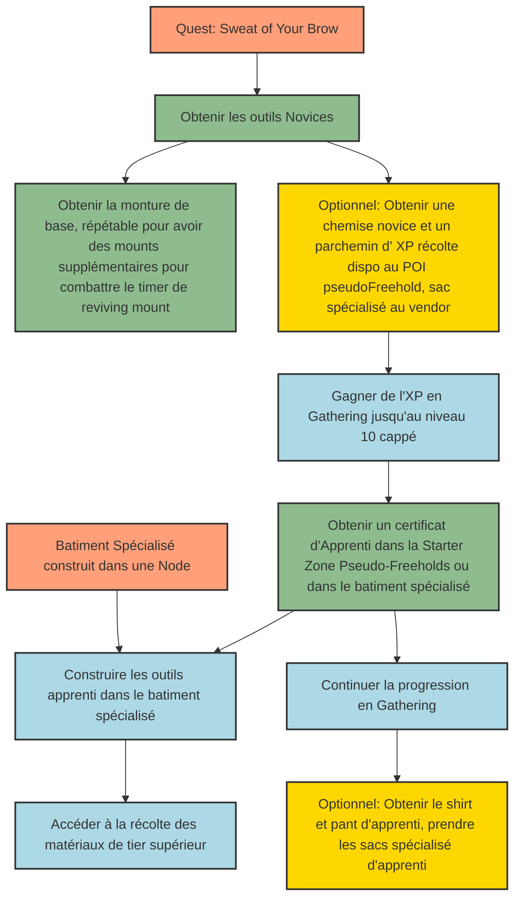
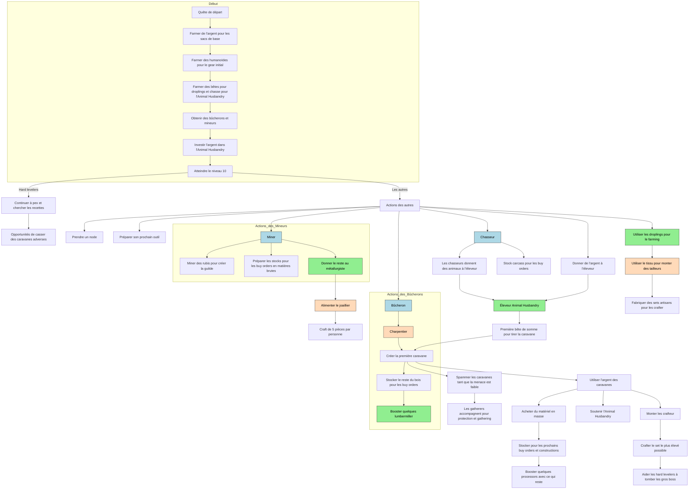

# Guide Stratégique pour l'Organisation de la Guilde lors de la Release

**Introduction**

**Ashes of Creation** offre une opportunité unique dans le monde du mmo pour une guilde de prendre de l'avance dans la course. Une organisation efficace, notamment en ce qui concerne les métiers et le craft, peut faire la différence entre une guilde qui excelle et une qui suit le peloton. Ce guide vise à présenter les différentes options d'organisation pour notre guilde, en mettant l'accent sur les stratégies optimales, tout en reconnaissant que chaque membre jouera selon ses préférences.

---

## 1. Compréhension des Métiers et de leurs Interrelations

Avant de définir une stratégie, il est crucial de comprendre comment les métiers s'articulent entre eux. Les métiers se divisent en trois catégories principales :

- **Gathering (Récolte)**
- **Processing (Traitement)**
- **Crafting (Artisanat)**

Chaque catégorie est interdépendante, et les matériaux récoltés sont traités puis utilisés pour fabriquer des objets.

```mermaid
graph TB

%% Define styles for professions and outputs
classDef gathering fill:#8FBC8F,stroke:#333,stroke-width:1px,color:#000;
classDef processing fill:#ADD8E6,stroke:#333,stroke-width:1px,color:#000;
classDef crafting fill:#DAA520,stroke:#333,stroke-width:1px,color:#000;
classDef adventuring fill:#D3D3D3,stroke:#333,stroke-width:1px,color:#000;
classDef material fill:#FFEFD5,stroke:#333,stroke-width:1px,color:#000;

%% Adventuring (Placed next to Gathering)
subgraph Adventuring
    direction TB
    Adv1[Adventuring]:::adventuring --> Dropplings:::material
end

%% Gathering (Positioned at the top with a Raw Material subgraph)
subgraph Gathering
    direction TB
    G1[Mining]:::gathering --> Stone
    G1 --> Metal_Ore
    G1 --> Gems

    G2[Lumberjacking]:::gathering --> Wood

    G3[Herbalism]:::gathering --> Plants
    G3 --> Textile

    G4[Hunting]:::gathering --> Animals
    G4 --> Carcass

    G5[Fishing]:::gathering --> Fish

    P3[Lumber Milling]:::processing
    Wood --> P3
    P3 --> Lumber:::material
    P3 --> Chips:::material
    
    P9[Farming]:::processing
    Plants --> P9
    Chips --> P9
    Dropplings --> P9
	Mulch --> P9
    P9 --> Mulch:::material
	P9 --> Fruits:::material
	P9 --> Vegetable:::material
    P9 --> Textile:::material 


    %% Raw Material Subgraph
    subgraph Raw_Material
        direction TB
        Stone:::material
        Metal_Ore:::material
        Gems:::material
        Wood:::material
        Animals:::material
        Carcass:::material
        Fish:::material
        Plants:::material
        Dropplings:::material
    end
end

%% Processing
subgraph Processing
    direction TB
    P1[Stonemasonry]:::processing
    Stone --> P1
    Gems --> P1
    P1 --> Stone_Fragment:::material
    P1 --> Stone_Sand:::material
    P1 --> Cut_Gems:::material
    P1 --> Mold:::material

    P2[Metalworking]:::processing
    Metal_Ore --> P2
    P2 --> Metal_Fragment/lingo:::material



    P4[Tanning]:::processing
    Carcass --> P4
    P4 --> Leather:::material
    P4 --> Bone:::material
    P4 --> Fat:::material

    P5[Weaving]:::processing
    Textile --> P5
    P5 --> Thread/bolt:::material
	P5 --> Warp:::material
	P5 --> Fiber:::material

    P6[Alchemy]:::processing
    Plants --> P6
    Gems --> P6
    Powder --> P6
    P6 --> Powder:::material
    P6 --> Salve/potion
    P6 --> Ink:::material


    P8[Animal Husbandry]:::processing
    Animals --> P8
    P8 --> Beast_of_Burden:::material
    P8 --> Mount:::material
    
    P7[Cooking]:::processing
    Fish:::material --> P7
	Carcass:::material --> P7
    Plants:::material --> P7
    Seasonning:::material --> P7
    Meat:::materialt --> P7
    Filet:::material --> P7
    Fruits:::material --> P7
    P7 --> Food
	P7 --> Ingredient:::material
	P7 --> Seasonning:::material
	P7 --> Meat:::material
	P7 --> Filet:::material

end

%% Crafting
subgraph Crafting
    direction TB
    


    C1[Weapon Smithing]:::crafting
    Lumber:::material --> C1
    Metal_Fragment/lingo:::material --> C1
    C1 --> Weapons

    C2[Armor Smithing]:::crafting
    Metal_Fragment/lingo:::material --> C2
    Leather:::material --> C2
    C2 --> Heavy_Armor

    C3[Leatherworking]:::crafting
    Leather:::material --> C3
    Thread/bolt:::material --> C3
    C3 --> Medium_Armor

    C4[Carpentry]:::crafting
    Lumber:::material --> C4
    Thread/bolt:::material --> C4
    C4 --> Bows
    C4 --> Caravan

    C5[Tailoring]:::crafting
    Thread/bolt:::material --> C5
    Leather:::material --> C5
    C5 --> Light_Armor

    C6[Arcane Engineering]:::crafting
    Lumber:::material --> C6
    Metal_Fragment/lingo:::material --> C6
	C6 --> Survey_Pilon
    C6 --> Enchanting_Charm
    C6 --> Spell_book
    C6 --> Focus
    C6 --> Wands

    C7[Jeweler]:::crafting
    Cut_Gems:::material --> C7
    Stone_Sand:::material --> C7
    Metal_Fragment/lingo:::material --> C7
    C7 --> Jewel

    C8[Scribe]:::crafting
    Thread/bolt:::material --> C8
    Powder:::material --> C8
    Ink:::material --> C8
    C8 --> Scrolls
end
```

---

## 2. Limitations et Contraintes des Métiers

- **Spécialisations Limitées** : Chaque joueur peut atteindre le rang de Grand Maître dans **seulement deux métiers**.
- **Progression Dépendante des Structures** : L'accès aux paliers supérieurs des métiers est conditionné par la disponibilité des bâtiments appropriés dans le monde.
- **Outils Spécialisés pour les Gatherers** : Les gatherers nécessitent des outils spécifiques pour accéder aux ressources de tiers supérieurs. Ces outils sont fabriqués dans des bâtiments qui peuvent ne pas être immédiatement disponibles, ce qui peut limiter l'avance acquise en XP.

---

## 3. Pourquoi Se Concentrer sur le Crafting ?

Le crafting entre en compétition directe avec le farming de gear. L'intention du jeu est que les équipements craftés soient supérieurs, mais il faudra rester vigilant sur cet équilibre pour se concentrer sur ce qui est le meilleur à un instant donné. Il existe également une compétition entre :

- **Farm d'XP /Farm d'équipement**
- **Farm de ressource/craft**

Le farm d'equipement semble le moyen le plus rapide d'avoir du vert et du bleu.
Le crafting semble être le moyen le plus sûr d'obtenir les meilleurs équipements sans trop dépendre du hasard, surtout si nous mutualisons les ressources les plus rares. Cela est rendu possible grâce à des gatherers spécialisés qui focus sur le rareté, des processors fed qui augmente encore plus la rareté et des crafteurs fed. Chaque étape du process retire un peu de RNG et permet d'améliorer le résultat final.

Imaginez d'un coté 50 joueurs qui gather dans leur coin, qui process dans leur coin, et craft dans leur coin et de l'autre des gens qui focus sur un seul gathering à la fois qui feed des processors.

__DANS LE MEME TEMPS__, les premiers n'auront ni la quantité (encombrement difficile à gerer ou obligeant à faire plus d'aller retour), pas autant de matériaux rare (par manque de bonus sac et bonus de processing), et des craft pas autant poussé que les seconds.

Cependant, ce que nous gagnons en efficacité collective, nous le perdons en autonomie individuelle,. 
Cette approche repose fortement sur la confiance entre les membres de la guilde, ce qui nous rend vulnérables par design aux frictions sociales, au "bus factor" (le risque que des membres clés deviennent indisponibles) et à la trahison. 
Il est donc essentiel de mettre en place des mécanismes pour gérer ces risques. 
En reconnaissant ces vulnérabilités, nous pouvons renforcer notre cohésion et assurer le succès à long terme de notre stratégie collective.

---

## 4. Options d'Organisation pour la Guilde

### Option 1 : Spécialisation Unique par Joueur

**Description** : Chaque membre se concentre sur **un seul métier de Gathering et un seul de Processing**. Certains matériaux très demandés (copper, zinc, grem, willow, flax) seront tout de même récoltés par tous.

**Avantages** :

- **Progression Rapide** : Se concentrer sur un seul métier permet une montée en niveau plus rapide. Les bonus de rarité augment aussi l'xp. Cela sera surement amplifié avec la venue des skill tree d'artisan.
- **Accès Anticipé aux Ressources de Haut Niveau** : Atteindre rapidement les tiers supérieurs réduit la compétition pour ces ressources.
- **Optimisation des Ressources** : Les sacs et équipements spécialisés offrent des bonus maximisés lorsqu'ils sont dédiés à un seul type de ressource. On peut stacker 2 à 3 bonus de sacs selon les spécialités.

**Inconvénients** :

- **Attente des Bâtiments Appropriés** : La progression peut être ralentie en attendant que les bâtiments nécessaires pour fabriquer les outils de tiers supérieurs soient disponibles, empechant peut-être de benéficier des ressource de tier supérieurs malgré l'avance en XP obtenu. Cela n'empeche pas de bénéficié des bonus de sacs et plus tard de skill.
- **Logistique Interpersonnelle Complexe** : Nécessite des échanges fréquents entre joueurs pour obtenir les matériaux dont ils ont besoin, ce qui complique la gestion.
  Chaque personne a plus de quantité de ressource et de meilleur rarité, mais il est dépendant des autre pour les Buy Order et les crafts. 
- **Opportunité raté** On passe plus souvent à coté de ressource qu'on ne récolte pas, mais en équipe, tout les métiers devrait être couvert.

### Option 2 : Polyvalence avec Plusieurs Métiers de Gathering

**Description** : Les membres choisissent **plusieurs métiers de Gathering**, profitant de l'opportunité de récolter ce qu'ils trouvent en chemin.

**Avantages** :

- **Autonomie Accrue** : Les joueurs peuvent soutenir leurs propres besoins en matériaux.
- **Réduction des Temps Morts** : Récolte opportuniste lors des déplacements.
- **Gameplay Varié** : Plus aligné avec les préférences personnelles de jeu.
- **Progression Globale plus rapide** :  peut permettre de monter tous les gathers plus rapidement sur le long terme, mais chaque gather individuel progressera plus lentement.

**Inconvénients** :

- **Efficacité Réduite** : Les bonus des sacs sont moins optimisés et il faut avoir et changer l'équipements selon ce qu'on récolte.
- **Progression Plus Lente Du Métier** : Monter plusieurs métiers simultanément dilue l'expérience gagnée entre les différents métiers et diminue très légèrement l'xp gagné ou la vitesse de récolte.
- **Gestion Logistique Personnelle Complexe** : Multiplication des types de matériaux entraîne une gestion d'inventaire plus compliquée et donc plus d'aller retour ou plus de suppression de ressource. Une perte d'efficacité globale.

---

## 5. Recommandation Stratégique

- **Focus sur un Gathering au début** : Pour maximiser l'efficacité et la progression rapide dans ces métiers, tout en réduisant la logistique personnelle.

**Justification** :

- **Optimisation de la Progression** : Les joueurs spécialisés atteindront les tiers supérieurs plus rapidement, bénéficiant à l'ensemble de la guilde.
- **Flexibilité à Long Terme** : Une fois les métiers principaux maîtrisés, les joueurs pourront diversifier leurs compétences.

---

### Priorisation des Processors

- **Investissement Collectif** : Identifier les processors à prioriser et concentrer les ressources pour les monter rapidement. 
- **Praticité des Stations** : Les gros lots de traitement sont plus pratiques, surtout pour rassembler les éléments rares. Bien qu'il n'y ait pas de grande différence de rentabilité en termes de ressources, cela permet une gestion du temps plus efficace.
- **Nécessité des Buy Orders** : Les bâtiments de la node nécessitent beaucoup de matériaux bruts au début, ce qui entre en concurrence avec les besoins des processors. Stocker une partie des matériaux bruts avant de les traiter permet de répondre aux Buy Orders tout en bénéficiant du bonus de stacking dans les entrepôts.
- **Risques de Gestion** : Centraliser les ressources peut présenter un risque de "bus factor" ou de trahison. Il faut concentrer les ressources pas sur une personne mais sur quelques personnes pour diliuer ce risque.
- Il est de toute façon difficile de se retrouver tous en ville tous en même temps sans perdre de temps.
- On fait simple, on prend la liste de priorité et on prend le premier qui est en ville en ce moment là. Ca dilue le risque, permet de concentrer les ressources un maximum, permet de bien utilisé les stations et tout en restant pratique pour tout lee monde.

### Priorisation du Crafting

- **Sélection des Métiers de Crafting Stratégiques** :
  - **Carpentry** : Pour la fabrication de caravanes, cruciales pour l'économie initiale.
  - **Tailoring** : Pour produire rapidement des équipements artisanaux de qualité (vestes et pantalons artisanat) qui influencent l'XP, la rareté, la quantité et la vitesse de récolte.
  - **Joaillerie** : Très interessant en raison du nombre de slots d'équipement disponibles (5 slots) et parce que tous les joueurs peuvent les équiper, contrairement au crafteur d'armure, qui sont split en 3(light medium heavy), et crafteur d'arme, séparer en 3(carpenter pour les arcs,Arcane pour les magies, et forgerons pour le reste).
Il se trouve que c'est 3 métiers sont assez complémentaire et n'ont que peu d'overlap de besoin.

- **Les outils** : Il est interessant d'utiliser la qualité maximum disponible pour créer son outil, mais pas il faut pas se concentrer dessus, car les outils changent à chaque pallier.
---

**session de gather lors de l'accompagnment de caravane** :

**Approche du "Trickle-Down"** : Tout les crafts/loot ne sont pas soulbound. Aider les tops levelers de la guilde doit faire redescendre le bon stuff sur tout le reste de la guilde, donnant une dynamique d'aider les plus compétitif/hard leveler, tout en benéficiant à tout le monde.
---

### Simple Combo for gatherer + processor)

Hunt+Tanning
Hunt+Animal Husbandry
Hunt+Weaving (cocoon => silk)
Hunt+Farming (farming beast for hunt = dropling)

Herbalism+alchemy
Herbalism+Farming
Herbalism+Weaving

Lumberjack+Milling

Mining+stonemason
Mining+metalworker 

Fish+cooking

# Path

=> Quete de départ
=> farmer quelques argent pour les sac de bases.
=> Farming humanoid for initial gear 
=> Farming beast for dropling+hunt for animal husbandry
=> get some lumberjack and miner going
=> Feed quelques personne dans l'animal husbandry (ils ont besoin d'argent, d'animaux, de temps et de la luck je crois) **à préciser**
=> Get to level 10
=> Les hard leveler: continue de pex et cherche les recettes. On les laisse pexé sauf si il y a opportunité de casser des caravanes adverses.
=> Les autres :
=> prendre un node ? 
=> former la guilde ?
=> get a carpenter up and running
=> Make the first caravans
=> Spam caravan while threat is low. If needed gatherer can gather along side the caravan for protection + gather mission.
=> On utilise l'argent des caravanes pour soit acheter en masse du materiel ou soutenir l'animal husbandry.
=> On stocke les next buy order / besoin en construction
=> boost quelques processors pour améliorer les rendements en conservant le stock pour les buy order (les stations devraient de toute façon être le bottleneck)
=> Utiliser tout le metal pour les outils (1 par personne, à trouver soit même) et ensuite on feed un joailler qui craft 5 pieces par personne.
=> Utiliser tout les dropling pour feed quelques farmers
=> Utiliser tout le tissu pour up des tailleurs et faire des set artisan pour chacun ? **pas sûr à tester la différence entre les rarités)**
=> essayer de crafter un set le plus élévé que possible pour aider les hard leveler à faire la diff et à tomber les gros boss.

## 9. Importance des Tests Avant la Release

- **Profiter des Wipes** : Utiliser les phases de test pour expérimenter différentes stratégies.
- **Adaptabilité** : Rester flexible et prêt à ajuster les plans en fonction des retours d'expérience.
- **Formation des Membres** : Familiariser chacun avec les rôles et responsabilités prévus.

---

## Conclusion

La réussite de la guilde lors de la release d'Ashes of Creation dépendra de notre capacité à nous organiser efficacement, à collaborer et à nous adapter.
En adoptant une stratégie réfléchie, en maximisant les forces individuelles et en favorisant le travail d'équipe, nous pourrons prendre une avance significative dans la course et établir notre guilde comme une force incontournable dans notre petit serveur.

---

**Note Finale** : Il est essentiel de rappeler que ces recommandations sont basées sur les informations actuelles du jeu, qui est encore en alpha et susceptible de changer. La flexibilité et la communication resteront nos meilleurs atouts pour nous adapter aux évolutions du jeu et aux préférences de chacun.

---
